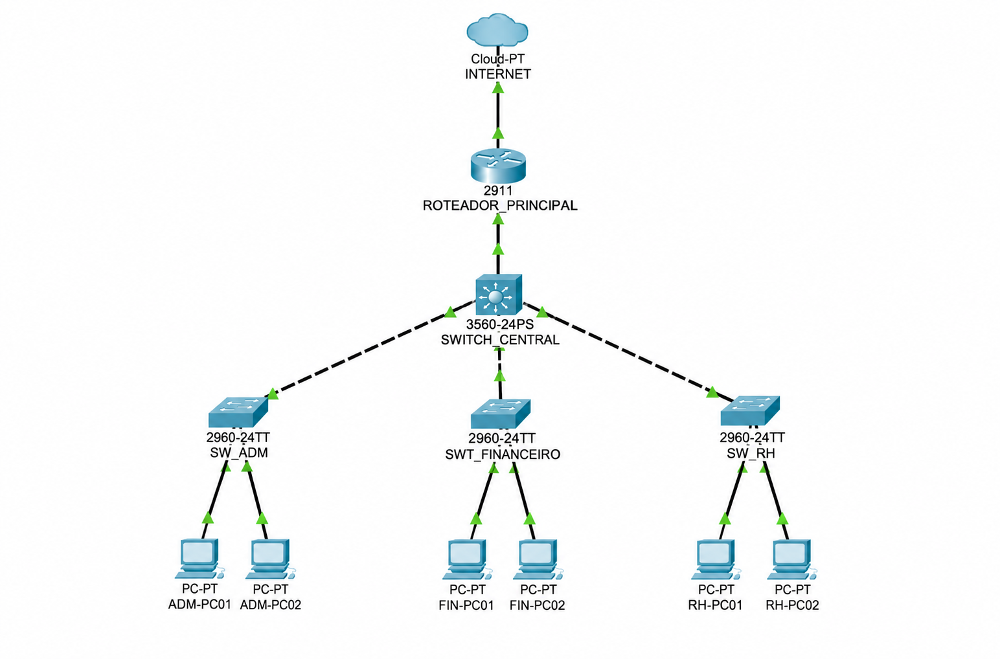

# Laboratório 02 - VLANs, DHCP e ACLs

## 📌 Objetivo

Implementar uma infraestrutura de rede corporativa utilizando o Cisco Packet Tracer, simulando uma empresa com três setores: Administração, Financeiro e Recursos Humanos.

## 🖥️ Topologia

## 🔹 VLANs

Foram criadas três VLANs para segmentar a rede:

- VLAN ADM
- VLAN FINANCEIRO
- VLAN RH

A segmentação proporciona isolamento entre os diferentes departamentos.

## 🔹 Roteamento Inter-VLAN

Foram configurados gateways para cada VLAN, permitindo a comunicação entre as redes por meio do roteador de forma controlada.

## 🔹 DHCP

Foi configurado o serviço DHCP para que os computadores recebam automaticamente:

- Endereço IP
- Máscara de sub-rede
- Gateway padrão

Isso elimina a necessidade de configuração manual em cada dispositivo.

## 🔐 ACLs

Foram configuradas Access Control Lists (ACLs) para controlar o tráfego entre os setores.

A regra principal implementada foi:

- Financeiro ↔ RH: comunicação bloqueada
- Administração → demais setores: acesso permitido

## 🧪 Testes realizados

Foram realizados testes de conectividade utilizando `ping` para validar:

- Isolamento entre os setores;
- Comunicação Inter-VLAN;
- Funcionamento do DHCP;
- Aplicação das regras de ACL;
- Acesso à nuvem, representando a Internet simulada.

## 📚 Principais aprendizados

Este laboratório permitiu praticar:

- VLANs;
- Roteamento Inter-VLAN;
- DHCP;
- ACLs;
- Gateways;
- Segmentação de redes;
- Controle de acesso;
- Testes e troubleshooting de conectividade.

## 🛠️ Ferramenta

- Cisco Packet Tracer
