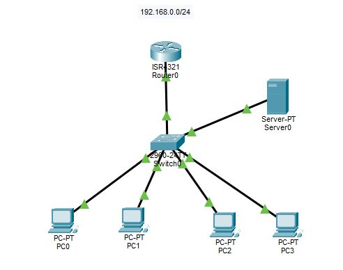

# Laboratório 01 — Router-on-a-Stick + DHCP

## 📌 Objetivo

Implementação, do zero, de uma topologia de rede corporativa utilizando o Cisco Packet Tracer, colocando em prática conceitos de segmentação, roteamento Inter-VLAN e DHCP.

## 🖥️ Topologia



A topologia é composta por:

- 1 Router Cisco ISR 4321
- 1 Switch Cisco 2960-24TT
- 1 Server-PT
- 4 PCs

Rede utilizada:

`192.168.0.0/24`

## 🔹 VLANs

Foram configuradas duas VLANs:

- VLAN 25
- VLAN 26

A comunicação entre as VLANs foi realizada utilizando **Router-on-a-Stick**, com uma interface trunk entre o switch e o roteador e subinterfaces configuradas no roteador.

## 🔹 DHCP

Foi utilizado um servidor dedicado para fornecer endereços IP aos dispositivos da rede.

Na VLAN 26, foi configurado **DHCP Relay** utilizando o comando:

```bash
ip helper-address
